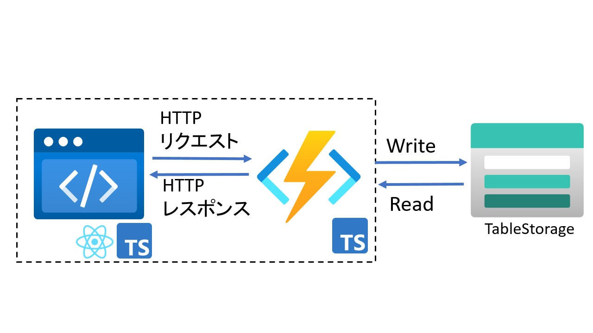

# anyway-cheerful-sns

　とにかく明るくなれるSNS

## 構成図



## 前提条件

- Visual Studio Code
- GitHub アカウント
- Node.js 16.x
- [Azure CLI](https://learn.microsoft.com/ja-jp/cli/azure/)
- [Azure Functions Core Tools](https://learn.microsoft.com/ja-jp/azure/azure-functions/functions-core-tools-reference?tabs=v2)
- [Static Web Apps CLI](https://azure.github.io/static-web-apps-cli/)
- [Azurite](https://learn.microsoft.com/ja-jp/azure/storage/common/storage-use-azurite?toc=%2Fazure%2Fstorage%2Fblobs%2Ftoc.json&bc=%2Fazure%2Fstorage%2Fblobs%2Fbreadcrumb%2Ftoc.json&tabs=visual-studio-code)
- [Azure Storage Explorer](https://azure.microsoft.com/ja-jp/products/storage/storage-explorer/)

## 使い方

### ローカルでの開発

1. このリポジトリをクローン
2. api/local.settings.jsonを作成
   1. [api/README.md](./api/README.md)を参考
3. パッケージのインストール

    ```bash
    npm install
    cd api
    npm install
    ```

4. Azriteの起動
   1. ctrl + shift + p
   2. Azurite: Start
5. ローカルサーバーの起動

    ```bash
    swa build
    swa start
    ```

### docs

- [プロジェクトの作成](./docs/MakeProject.md)

## 関連リンク

- [Azure Static Web Apps 用にローカル開発環境を設定する](https://learn.microsoft.com/ja-jp/azure/static-web-apps/local-development)
- [Core Tools を使用してローカルで Azure Functions を開発する](https://learn.microsoft.com/ja-jp/azure/azure-functions/functions-run-local?tabs=macos%2Cisolated-process%2Cnode-v4%2Cpython-v2%2Chttp-trigger%2Ccontainer-apps&pivots=programming-language-typescript)
- [クイックスタート: コマンド ラインから Azure に TypeScript 関数を作成する](https://learn.microsoft.com/ja-jp/azure/azure-functions/create-first-function-cli-typescript?tabs=macos%2Cazure-cli%2Cbrowser&pivots=nodejs-model-v3)
- [Azure Functions における Azure Tables のバインド](https://learn.microsoft.com/ja-jp/azure/azure-functions/functions-bindings-storage-table?tabs=in-process%2Ctable-api%2Cextensionv3&pivots=programming-language-javascript)
- [Storage Explorer の概要](https://learn.microsoft.com/ja-jp/azure/vs-azure-tools-storage-manage-with-storage-explorer?toc=%2Fazure%2Fstorage%2Fblobs%2Ftoc.json&bc=%2Fazure%2Fstorage%2Fblobs%2Fbreadcrumb%2Ftoc.json&tabs=macos)
